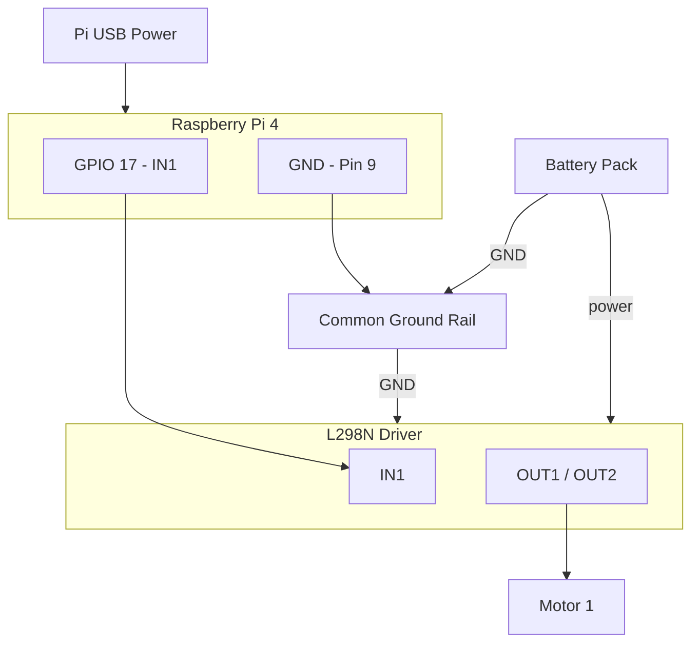

```mermaid
graph TD
    PiPower[Pi USB Power] --> Pi
    Batt[Battery Pack] -->|power| D1
    Batt -->|GND| GND_Bus[Common Ground Rail]

    subgraph Pi [Raspberry Pi 4]
        GPIO17[GPIO 17 - IN1]
        PiGND[GND - Pin 9]
    end

    PiGND --> GND_Bus
    GND_Bus -->|GND| D1

    subgraph D1 [L298N Driver]
        IN1[IN1]
        OUT[OUT1 / OUT2]
    end

    GPIO17 --> IN1
    OUT --> M1[Motor 1]
```

## Notes
- Only IN1 is used — motor can spin in one direction only (on/off)
- IN2 is not connected; no reverse capability at this stage
