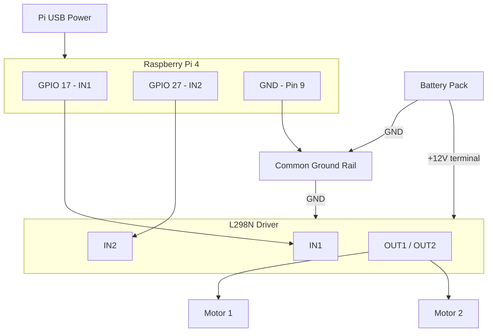

```mermaid
graph TD
    PiPower[Pi USB Power] --> Pi
    Batt[Battery Pack] -->|+12V terminal| D1
    Batt -->|GND| GND_Bus[Common Ground Rail]

    subgraph Pi [Raspberry Pi 4]
        GPIO17[GPIO 17 - IN1]
        GPIO27[GPIO 27 - IN2]
        PiGND[GND - Pin 9]
    end

    PiGND --> GND_Bus
    GND_Bus -->|GND| D1

    subgraph D1 [L298N Driver]
        IN1[IN1]
        IN2[IN2]
        OUT[OUT1 / OUT2]
    end

    GPIO17 --> IN1
    GPIO27 --> IN2

    OUT --> M1[Motor 1]
    OUT --> M2[Motor 2]
```

## Pin Logic

| IN1 | IN2 | Motor Behavior |
|-----|-----|----------------|
| HIGH | LOW  | Forward |
| LOW  | HIGH | Reverse |
| LOW  | LOW  | Stop (coast) |
| HIGH | HIGH | Stop (brake) |
