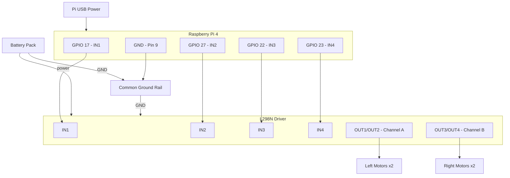

## Pin Logic

| IN1 | IN2 | Left Motors | IN3 | IN4 | Right Motors |
|-----|-----|-------------|-----|-----|--------------|
| HIGH | LOW  | Forward | HIGH | LOW  | Forward |
| LOW  | HIGH | Reverse | LOW  | HIGH | Reverse |
| LOW  | LOW  | Stop    | LOW  | LOW  | Stop |
