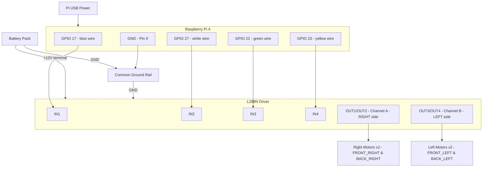

## Steering Logic (Tank Steering)

| Command | Left Side | Right Side | Result |
|---------|-----------|------------|--------|
| f  | Forward | Forward | Straight |
| r  | Reverse | Reverse | Reverse |
| tl | Stop    | Forward | Turn left |
| tr | Forward | Stop    | Turn right |
| sl | Reverse | Forward | Spin left in place |
| sr | Forward | Reverse | Spin right in place |
