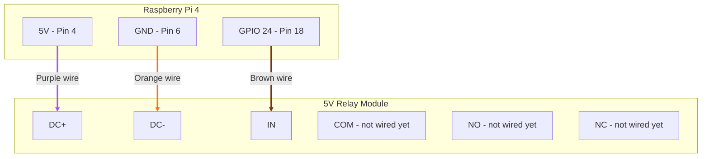

## Notes
- This step only wires the relay's **control side** (`DC+`, `DC-`, `IN`) to the Pi — nothing on the switching side (`NO`/`COM`/`NC`) is connected yet, so no pump or battery is involved
- This relay board (Songle SRD-05VDC-SL-C) has no physical trigger-level jumper despite the "high/low level trigger" silkscreen text — that's just generic printed spec text, not an adjustable part. Trigger polarity (active-high vs. active-low) was confirmed empirically by running `relay_test.py` and watching `LED1` / listening for the click
- Ground here is just the Pi's own GND pin — no need to touch the motor battery/shared ground rail until the pump is introduced in step 2

## Wire colors used
| Wire color | Pi pin | Relay terminal |
|---|---|---|
| Purple | Pin 4 (5V) | `DC+` |
| Orange | Pin 6 (GND) | `DC-` |
| Brown | Pin 18 (GPIO24) | `IN` |
