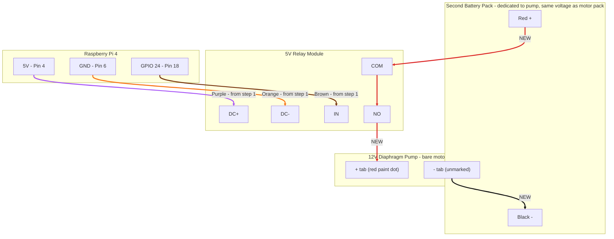

## What's new vs. step 1
Step 1's three control wires (purple/orange/brown) stay exactly as they are — don't touch them. This step adds the **switching side** of the relay, powered by its own dedicated battery pack (same voltage as the motor pack), completely separate from the L298N and motor battery:

- **Second battery red (+)** → relay `COM`
- **`COM` → `NO`**: internal to the relay — when the relay is energized, `COM` and `NO` connect, closing the circuit
- **`NO` → pump `+`**: new wire
- **Pump `-` → second battery black (-)**: new wire, completing a self-contained loop

This relay is opto-isolated, meaning its control side (`DC+`/`DC-`/`IN`, wired to the Pi) has no electrical connection to its switching side (`COM`/`NO`/`NC`) — it's just a mechanical switch. That's what makes running the pump off a totally separate battery straightforward: nothing needs to tie back to the Pi's ground or the motor battery at all. The L298N and motor battery pack are untouched by this step.

## Attaching wires to the pump (no soldering)
This pump has two bare flat metal tabs on the motor, not pre-attached leads. There's a small **red paint dot** next to one tab — that's the manufacturer's positive (+) marking. The other, unmarked tab is negative (-).

Try **male-to-male jumper wires** first — the motor tabs on the TT motors turned out to be too thin/flat for female jumper sockets to grip, and male-to-male worked there, so the pump's tabs (similarly flat) are likely the same:
- One end of the male-to-male wire presses/twists onto each flat tab (red-dot tab = `+`, unmarked tab = `-`) — if the tab has a small hole in it, threading the pin tip through the hole before bending it back gives a firmer mechanical hold
- The other end plugs into the relevant screw terminal (`NO` for the `+` tab, the ground junction for the `-` tab) and gets clamped by the screw

It's a friction contact either way, so give it a gentle tug to confirm it's not going to slip off, and a small wrap of tape over the joint doesn't hurt for extra security during testing. If male-to-male still doesn't hold well, alligator clip test leads (~$5, no tools) are the more secure fallback. Good enough for this bench test either way; we'll revisit a more permanent connection when mounting the pump on the chassis in step 4.

No embossed arrow was found on this pump body, so intake/outlet was determined by testing: the **right-hand port (as pictured, closer to the motor's power tabs) is the intake**, the **left-hand port is the outlet** — confirmed by submerging each side and watching which one bubbles air out under power. Keep this orientation for the nozzle test and final mounting.

## Wire colors used
| Wire color | From | To |
|---|---|---|
| Gray | Relay `NO` | Pump `+` tab (red paint dot) |
| Red (battery's own wire) | Second battery `+` | Relay `COM` |
| Black (battery's own wire) | Second battery `-` | Pump `-` tab (unmarked) |

## Alternative: sharing the motor battery pack instead
If two battery packs turns out to be too heavy or crowded once mounted on the chassis, the pump can instead share the existing motor battery pack — no separate pack needed. This was the original plan before deciding to try a dedicated pack first.

Wiring for this alternative:
- Battery **red (+)** needs to reach both the L298N's existing `+12V` terminal *and* the relay's `COM` terminal. Either loosen the L298N's `+12V` screw and insert a second wire alongside the existing one (if the terminal has room), or use a small 2-way screw terminal block as a junction: battery red in, two wires out (one to L298N, one to relay `COM`)
- Relay `NO` → pump `+` tab (same as the dedicated-battery version)
- Pump `-` tab → battery **black (-)**, sharing the same ground the L298N and Pi already use — no separate junction needed here since GND terminals typically have more room, or can share the existing ground rail

Trade-off: this removes the electrical isolation the dedicated-battery approach gives you, so if motors stutter or the Pi resets when the pump kicks on, that's voltage sag from sharing one pack across both loads — the fix at that point is to go back to a second battery.

## Safety notes
- **Never run the pump dry for more than a couple seconds** — a diaphragm pump needs liquid to lubricate and seal itself; running dry can damage it. Have the intake tubing sitting in a cup of water *before* you run the test script.
- Point the pump's outlet (no nozzle yet — just the bare barb fitting or a short piece of tubing) into a bowl or sink so the test water goes somewhere sensible.
- Keep the pump and any drips away from the Pi and L298N.

## Troubleshooting notes (from bench testing)
- **Water rises partway then falls back when the pump stops:** usually means the pump never built a fully continuous stream — check for (1) tubing not fully seated on the barb, leaving exposed ridges that leak air, and (2) too little water in the intake container, letting the tube gulp air. Both break suction the same way. Filling the intake bowl with more water resolved this in testing.
- **Confirmed working setup:** right port = intake (submerged in water), left port = outlet (into catch bowl), 15-second run time in `pump_test.py`.
